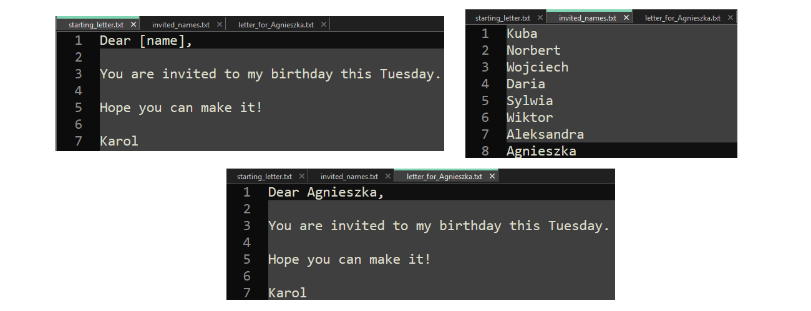

# Mail Merge 

With this program you can make personalised letters for  your guests.
Python program replaces "[name]" with the names you list in "invited_names.txt". Output files are saved in "Output" folder.
## Used technologies/frameworks/libraries/languages
Python 3.11, PyInstaller 6.11.1
## Installation
Download folder "client" and run "Mail-Merge.exe". You need to have Python installed on your machine to run this application.
## License
This project is licensed under the MIT License.
